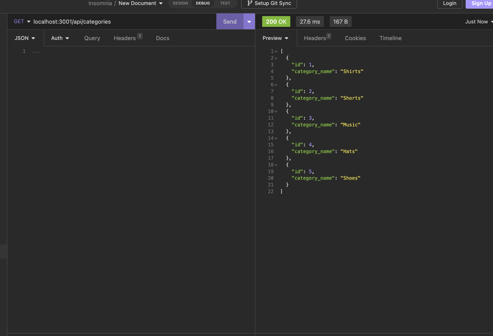

# or-mapping

## Description

This is a backend data base for an ecommerce website, it shows you the different routes for all categories, all products, and all tags. also single categories, pruducts, and tags. It is not finished yet, but plan on it in the near future. hope you enjoy!

## Installation

- `npm i`
- in terminal run `node server.js`
    
## Usage/Examples

- once you install packages
- you can can run node server.js in the terminal
- you can then test routes in insomnia
- GET `localhost:3001/api/categories` for example

## Screenshots

## License

[MIT](https://choosealicense.com/licenses/mit/)

